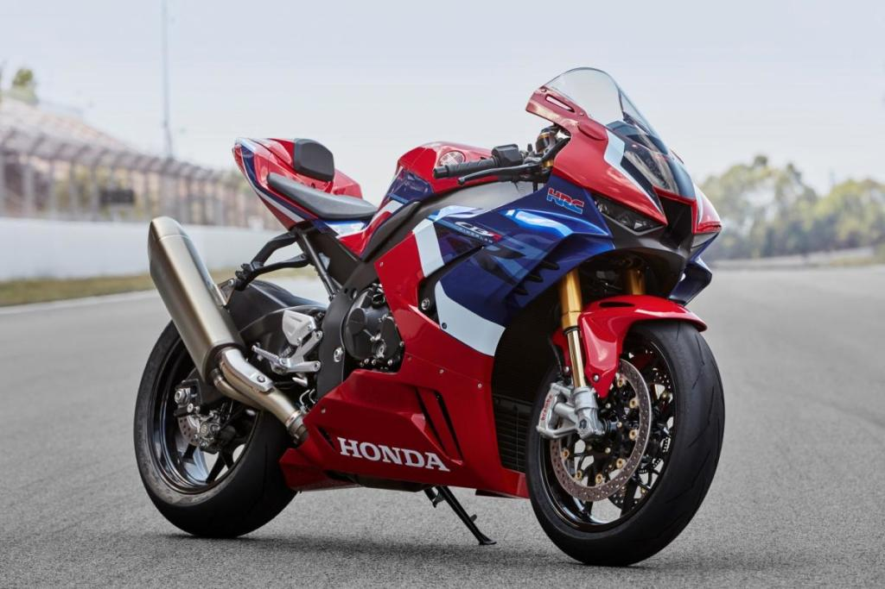

     
## PlatziVideo
* PlatziVideo fue realizado con HTML5 y CSS3 :tw-1f600:
* En este proyecto se hizo uso **normalize.css** para normalizar los estilos entre los diferentes navegadores.
* Este proyecto fue construido con **CSS Grid Layout** y **Flexbox**.